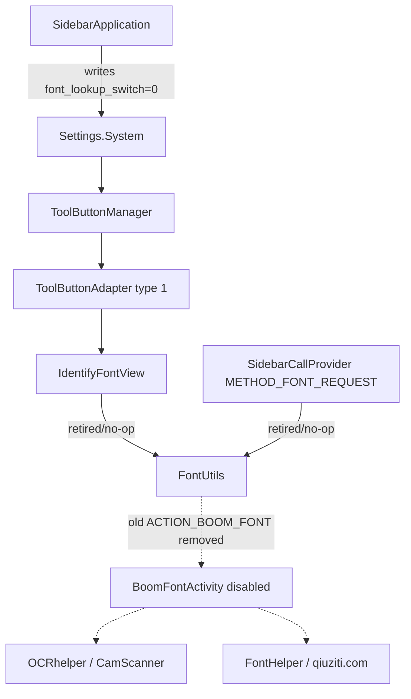

# Sidebar Font OCR Removal Plan

Generated by `tools/r2-sidebar-font-ocr-removal-audit.py` on 2026-06-20T21:17:29.

## Verdict

Sidebar/One Step font OCR should be retired, not migrated to PP-OCR. It is not
the same path as TextBoom image OCR: it starts from the One Step tool button or
`METHOD_FONT_REQUEST`, launches `BoomFontActivity`, delegates OCR to the
CamScanner/Intsig SDK, then uploads cropped glyphs and recognized text to
`qiuziti.com` for font matching.

The first ROM-safe removal should be behavioral, not a broad resource purge:
hide the entry, make launch helpers inert, and remove the implicit manifest
contract. Leave legacy classes/resources present until a live boot proves
Sidebar remains stable.

## Selected Strategy

- keep Sidebar package/component identity
- hide top-area font button layout root while preserving R.id.tool_button
- no-op IdentifyFontView.onClick
- no-op FontUtils.startOcrActivity and make toggleFont cleanup-only
- remove ACTION_BOOM_FONT intent-filter and disable BoomFontActivity
- do not delete backend classes/resources until live stability is proven

## Flow

## Evidence

| Area | Component | Status | Evidence | Finding | Patch decision |
| --- | --- | --- | --- | --- | --- |
| default-state | SidebarApplication | PASS | `reverse/smartisan-8.5.3-rom-static/jadx/system__system__priv-app__Sidebar__Sidebar.apk/sources/com/smartisanos/sidebar/SidebarApplication.java:44-59` | Application startup already writes Settings.System font_lookup_switch=0. | Keep this behavior. The removal patch should also make direct launch paths inert in case stale DB/settings state survives. |
| settings-ui | ToolsSwitchActivity | PASS | `reverse/smartisan-8.5.3-rom-static/jadx/system__system__priv-app__Sidebar__Sidebar.apk/sources/com/smartisanos/sidebar/setting/ToolsSwitchActivity.java:45-55,69-81` | The settings page finds font_lookup_switch_root and sets it to GONE, but still observes font_lookup_switch. | No user-visible settings row is expected. Keep it hidden and avoid relying on this as the only guard. |
| top-entry | ToolButtonManager | PASS | `reverse/smartisan-8.5.3-rom-static/jadx/system__system__priv-app__Sidebar__Sidebar.apk/sources/com/smartisanos/sidebar/util/ToolButtonManager.java:56-68,70-76,194-210` | ToolButtonManager can still add type 1 when font_lookup_switch is true or stale DB state includes it. | Do not hard-delete type 1 in the first patch. Hide/no-op the view and call path so stale state cannot crash Sidebar. |
| top-entry | ToolButtonAdapter | PASS | `reverse/smartisan-8.5.3-rom-static/jadx/system__system__priv-app__Sidebar__Sidebar.apk/sources/com/smartisanos/sidebar/toparea/view/ToolButtonAdapter.java:31-37,229-236` | Type 1 maps to tool_button_item_identify_font and the adapter expects R.id.tool_button inside the inflated view. | Keep R.id.tool_button present, but mark the layout root GONE/0dp so the entry disappears without a NullSafe/NPE risk. |
| top-entry | IdentifyFontView | PASS | `reverse/smartisan-8.5.3-rom-static/jadx/system__system__priv-app__Sidebar__Sidebar.apk/sources/com/smartisanos/sidebar/toparea/view/IdentifyFontView.java:67-105` | The top-area button directly calls FontUtils.startOcrActivity after UI checks. | Patch onClick to return immediately or rely on FontUtils no-op plus hidden view; verify startOcrActivity is no longer referenced from the method. |
| provider-entry | SidebarCallProvider | PASS | `reverse/smartisan-8.5.3-rom-static/jadx/system__system__priv-app__Sidebar__Sidebar.apk/sources/com/smartisanos/sidebar/storage/SidebarCallProvider.java:134-140` | METHOD_FONT_REQUEST can still reach FontUtils.toggleFont, including on external display contexts. | Make FontUtils.toggleFont inert so this provider branch remains stable but cannot launch font OCR. |
| launch-contract | FontUtils | PASS | `reverse/smartisan-8.5.3-rom-static/jadx/system__system__priv-app__Sidebar__Sidebar.apk/sources/com/smartisanos/sidebar/open/font/FontUtils.java:16-58,74-115` | FontUtils exposes ACTION_BOOM_FONT launch and ACTION_BOOM_FONT_DISMISS cleanup. | No-op startOcrActivity and toggleFont; keep isShowing/exit/dismiss safe for any already-running activity cleanup. |
| manifest-contract | BoomFontActivity | PASS | `reverse/smartisan-8.5.3-rom-static/jadx/system__system__priv-app__Sidebar__Sidebar.apk/resources/AndroidManifest.xml:282-298` | BoomFontActivity is exported through smartisanos.intent.action.BOOM_FONT and carries an Intsig ocr_key. | Remove the implicit intent-filter and set BoomFontActivity android:enabled=false in the APK candidate. |
| backend-retired | BoomFontActivity/OCRhelper/FontHelper | PASS | `reverse/smartisan-8.5.3-rom-static/jadx/system__system__priv-app__Sidebar__Sidebar.apk/sources/com/smartisanos/sidebar/open/font/BoomFontActivity.java:142-148,207-220,299-374` | The retired flow creates OCRhelper, calls CamScanner OCR, then posts font lookup data to qiuziti.com. | Do not integrate PP-OCR here. Leave backend code inert first; deep-delete classes/resources only after Sidebar stability is proven. |

## Build Gate

The APK candidate is allowed to change only:

- `AndroidManifest.xml`
- `classes.dex`
- `res/layout/tool_button_item_identify_font.xml`

The package name, shared UID, signing-certificate carrier, existing Sidebar
launcher-entry hide, and v0.29 topbar blank-slot behavior must remain intact.

## Next Step

Build the APK-only candidate first. After the APK verifies, wire it into a
v0.38 super image based on the current v0.37b FEC-preserving build path.
