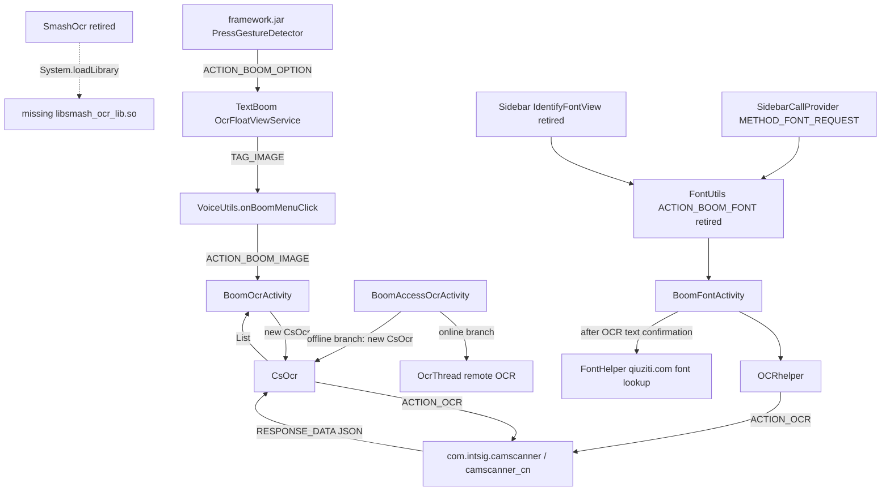

# TextBoom OCR Backend Map

Generated by `tools/r2-textboom-ocr-backend-map.py` on 2026-06-21T13:37:43.

## Verdict

- Current TextBoom image OCR is hard-wired to `CsOcr`, which calls the Intsig/CamScanner OpenAPI.
- `SmashOcr` is present as an unused `IOcrApi` implementation, but it requires `libsmash_ocr_lib.so`; this branch is now retired.
- The current live TextBoom APK inventory has `assets/tt_general_ocr_v1.0.model=True` and `libsmash_ocr_lib.so=False`.
- Sidebar/One Step font OCR is a separate route: `IdentifyFontView -> FontUtils -> BoomFontActivity -> OCRhelper -> CSOpenAPI -> CamScanner`.
- Sidebar font lookup has a second remote dependency after OCR: `FontHelper` uploads cropped glyph images plus confirmed text to `qiuziti.com`.
- Decision on 2026-06-20: retire Sidebar/One Step font OCR; PP-OCR is reserved for TextBoom image OCR modernization.

## Call Graph

## Evidence

| Area | Component | Backend | Branch | Status | Evidence | Finding |
| --- | --- | --- | --- | --- | --- | --- |
| framework-trigger | PressGestureDetector | TextBoom service launch | long-press image boom | PASS | `reverse/smartisan-8.5.3-rom-static/jadx/system__system__framework__framework.jar/sources/smartisanos/view/PressGestureDetector.java:204-244,1395-1440,1718-1741` | Framework starts com.smartisanos.textboom/.ocr.OcrFloatViewService and gates it through text_boom plus big_bang_ocr settings, keyguard state, launcher category, and OCR whitelist/blacklist checks. |
| settings-trigger | TextBoomConfigObserver | settings bundle | TextBoomUtils settings source | PASS | `reverse/smartisan-8.5.3-rom-static/jadx/system__system__framework__services.jar/sources/com/android/server/textboom/TextBoomConfigObserver.java:96-199,286-303,324-338` | Services observes text_boom, big_bang_ocr, and trigger-area settings, then publishes them to framework-side gesture code. Stock default for big_bang_ocr is disabled. |
| textboom-entry | OcrFloatViewService | TextBoom menu | ACTION_BOOM_OPTION | PASS | `reverse/smartisan-8.5.3-rom-static/jadx/system__system__app__TextBoom__TextBoom.apk/sources/com/smartisanos/textboom/ocr/OcrFloatViewService.java:57-58,91-105,166-197,200-217` | The foreground service takes screenshots and shows the option UI. When image OCR is chosen it delegates to VoiceUtils.onBoomMenuClick. |
| textboom-entry | VoiceUtils | TextBoom activity launch | TAG_IMAGE -> ACTION_BOOM_IMAGE | PASS | `reverse/smartisan-8.5.3-rom-static/jadx/system__system__app__TextBoom__TextBoom.apk/sources/com/smartisanos/textboom/voice/VoiceUtils.java:529-570` | TAG_IMAGE creates an intent with Constant.ACTION_BOOM_IMAGE and starts the OCR activity after a short UI delay. |
| textboom-entry | AndroidManifest | TextBoom exposed contracts | BOOM_IMAGE / BOOM_ACCESSBILITY / BOOM_OPTION | PASS | `reverse/smartisan-8.5.3-rom-static/jadx/system__system__app__TextBoom__TextBoom.apk/resources/AndroidManifest.xml:73-78,115-124,141-149,166-175,202-209` | Manifest exposes BoomOcrActivity, BoomAccessOcrActivity, OcrFloatViewService, TextBoomCallProvider, FileProvider, and an Intsig OCR key. |
| textboom-backend | BoomOcrActivity | CsOcr | normal and extended crop OCR | PASS | `reverse/smartisan-8.5.3-rom-static/jadx/system__system__app__TextBoom__TextBoom.apk/sources/com/smartisanos/textboom/ocr/BoomOcrActivity.java:209-212,344-349,505-534,614-648` | initView hard-codes new CsOcr. Both main crop and extended crop call mOcrApi.startOcr, and onActivityResult delegates to mOcrApi.handleOcrResult. |
| textboom-backend | BoomAccessOcrActivity | CsOcr fallback plus online OCR | accessibility OCR | PASS | `reverse/smartisan-8.5.3-rom-static/jadx/system__system__app__TextBoom__TextBoom.apk/sources/com/smartisanos/textboom/ocr/BoomAccessOcrActivity.java:222-237,279-300,338-340` | initOcr hard-codes new CsOcr. doOcr uses an online OcrThread when connected and falls back to mOcrApi.startOcr when offline. |
| textboom-backend | CsOcr | Intsig/CamScanner OpenAPI | external activity OCR | PASS | `reverse/smartisan-8.5.3-rom-static/jadx/system__system__app__TextBoom__TextBoom.apk/sources/com/smartisanos/textboom/ocr/CsOcr.java:25-35,36-81,83-123,125-145,152-174` | CsOcr implements IOcrApi, creates CSOpenAPI, checks CamScanner install/availability, writes imageboom.jpg, grants FileProvider Uri permission, starts Intsig OCR, then converts CSOcrResult lines into TextBoom OcrInfo. |
| textboom-backend | CSOpenApiV1 (TextBoom copy) | Intsig/CamScanner OpenAPI | FileProvider Uri OCR | PASS | `reverse/smartisan-8.5.3-rom-static/jadx/system__system__app__TextBoom__TextBoom.apk/sources/com/intsig/csopen/sdk/CSOpenApiV1.java:19-31,49-83,216-245,253-289` | TextBoom's bundled SDK requires CamScanner version >= 53500, grants Uri permission only to com.intsig.camscanner, sends ACTION_OCR, and parses RESPONSE_DATA JSON. |
| textboom-unused | SmashOcr | ByteDance smash native OCR | unused IOcrApi implementation | PASS | `reverse/smartisan-8.5.3-rom-static/jadx/system__system__app__TextBoom__TextBoom.apk/sources/com/smartisanos/textboom/ocr/SmashOcr.java:25-36,39-67,71-110` | SmashOcr is an IOcrApi implementation, but its static initializer loads libsmash_ocr_lib.so and its process path wraps a ByteDance GeneralOcrWrapper model. |
| textboom-unused | GeneralOcrWrapper | JNI wrapper | SmashOcr native calls | PASS | `reverse/smartisan-8.5.3-rom-static/jadx/system__system__app__TextBoom__TextBoom.apk/sources/com/bytedance/smash/ocr/GeneralOcrWrapper.java:34-51` | GeneralOcrWrapper is a JNI wrapper around InitModel and Process; it does not load the missing native library by itself. |
| sidebar-entry | IdentifyFontView | Sidebar font OCR entry | top-area button | PASS | `reverse/smartisan-8.5.3-rom-static/jadx/system__system__priv-app__Sidebar__Sidebar.apk/sources/com/smartisanos/sidebar/toparea/view/IdentifyFontView.java:67-105` | The One Step top-area font button toggles FontUtils.startOcrActivity after fullscreen and sidebar-state checks. |
| sidebar-entry | SidebarCallProvider | Sidebar font OCR entry | METHOD_FONT_REQUEST | PASS | `reverse/smartisan-8.5.3-rom-static/jadx/system__system__priv-app__Sidebar__Sidebar.apk/sources/com/smartisanos/sidebar/storage/SidebarCallProvider.java:134-140` | The provider METHOD_FONT_REQUEST also reaches FontUtils.toggleFont, including external-display context handling. |
| sidebar-entry | FontUtils | Sidebar font OCR activity launch | ACTION_BOOM_FONT | PASS | `reverse/smartisan-8.5.3-rom-static/jadx/system__system__priv-app__Sidebar__Sidebar.apk/sources/com/smartisanos/sidebar/open/font/FontUtils.java:16-58,74-115` | FontUtils toggles smartisanos.intent.action.BOOM_FONT, tracks active activities per display, and broadcasts dismiss state. |
| sidebar-backend | AndroidManifest | Sidebar font OCR contract | BoomFontActivity | PASS | `reverse/smartisan-8.5.3-rom-static/jadx/system__system__priv-app__Sidebar__Sidebar.apk/resources/AndroidManifest.xml:282-298` | Sidebar declares BoomFontActivity for ACTION_BOOM_FONT and embeds a separate Intsig OCR key. |
| sidebar-backend | BoomFontActivity | OCRhelper / Intsig OCR plus qiuziti font lookup | crop -> OCR -> font-upload | PASS | `reverse/smartisan-8.5.3-rom-static/jadx/system__system__priv-app__Sidebar__Sidebar.apk/sources/com/smartisanos/sidebar/open/font/BoomFontActivity.java:94-118,142-148,207-220,299-374` | BoomFontActivity creates OCRhelper, runs OCR on the crop, asks the user to confirm text, then uploads character image slices plus text to a font-recognition service. |
| sidebar-backend | OCRhelper | Intsig/CamScanner OpenAPI | file-path OCR | PASS | `reverse/smartisan-8.5.3-rom-static/jadx/system__system__priv-app__Sidebar__Sidebar.apk/sources/com/smartisanos/sidebar/open/font/OCRhelper.java:31-33,50-71,82-111` | OCRhelper reads ocr_key metadata, creates CSOpenAPI, checks CamScanner availability, starts OCR on FileHelper.OCR_IMAGE_PATH, and returns CSOcrResult to BoomFontActivity. |
| sidebar-backend | CSOpenApiV1 (Sidebar copy) | Intsig/CamScanner OpenAPI | file-path OCR | PASS | `reverse/smartisan-8.5.3-rom-static/jadx/system__system__priv-app__Sidebar__Sidebar.apk/sources/com/intsig/csopen/sdk/CSOpenApiV1.java:41-79,202-230,239-276` | Sidebar's bundled SDK checks providers/version, starts ACTION_OCR with Uri.fromFile/image_src, and parses RESPONSE_DATA JSON into CSOcrResult. |
| sidebar-network | FontHelper | remote font-recognition service | post-OCR font match | PASS | `reverse/smartisan-8.5.3-rom-static/jadx/system__system__priv-app__Sidebar__Sidebar.apk/sources/com/smartisanos/sidebar/open/font/FontHelper.java:19-58,93-107,118-136` | After OCR, Sidebar uploads cropped character JPEGs and recognized text to http://www.qiuziti.com/s/uploadOne.ashx for font lookup. |

## Current APK Inventory

- APK: `apks/textboom-live/TextBoom-live-v3.2.2-base.apk`
- native libs: 13 (libEncryptorP.so, libaudioencoder_vb.so, libc++.so, libc++_shared.so, libcutils.so, liblens.so, liblensyuv.so, liblog.so, libmp3lame_vb.so, libmsc_voice.so, libnativehelper.so, libutils.so, libvndksupport.so)
- `assets/tt_general_ocr_v1.0.model`: True
- `libsmash_ocr_lib.so`: False

## Route Decisions

| Option | Status | Reason | First gate |
| --- | --- | --- | --- |
| Add libsmash_ocr_lib.so and switch to SmashOcr | retired | User decision on 2026-06-20 stops the SmashOcr route. The native library is absent and this branch is no longer worth engineering time. | No further SmashOcr work. Keep only as reverse-engineering evidence. |
| Bypass SmashOcr native loader | retired | Bypassing the native loader would still spend work on an abandoned branch. A new IOcrApi-compatible local backend is cleaner. | Do not patch SmashOcr internals. |
| Keep CsOcr and preserve CamScanner dependency | temporary baseline | This is current behavior and probably why v0.37b can run TextBoom, but it keeps an external OCR provider and old dependency chain. | Use it only to compare PP-OCR latency/accuracy and to prove feature parity. |
| Remove Sidebar/One Step font OCR | selected | This is separate from TextBoom image OCR and still depends on CamScanner plus qiuziti.com font lookup. The feature is not worth modernizing. | Build an APK-level Sidebar patch that hides the top-area font button, makes FontUtils font launch inert, and removes ACTION_BOOM_FONT exposure. |
| Integrate Baidu/PaddleOCR local engine | selected TextBoom route | Current official PaddleOCR deploy/ppocr-android is a PP-OCRv6 Android Demo using ONNX Runtime. PP-OCRv6 small is the main TextBoom replacement candidate; tiny is only a speed/power fallback. | Intake official ppocr-sdk first, compare CsOcr baseline vs PP-OCRv6 small on R2 screenshots, then patch TextBoom only after PASS. |

## Benchmark Plan Before Replacement

Targets:

1. Current `CsOcr` route as the live baseline. This measures user-visible latency and failure modes, but it includes CamScanner activity launch overhead and any provider/network behavior.
2. Baidu/PaddleOCR local route using official `deploy/ppocr-android/ppocr-sdk`, PP-OCRv6 small, and ONNX Runtime Android native CPU inference. The already-proven PP-OCRv6 tiny zero-tensor smoke is only a compatibility proof and speed/power fallback.
3. Sidebar/One Step font OCR is not a benchmark target. It is retired because its end-to-end feature still depends on the separate qiuziti.com font-recognition service after OCR.

Metrics:

- cold init time, warm inference time, p50/p95 end-to-end latency
- PSS/RSS memory during first OCR and repeated OCR
- model/APK/system partition footprint
- line recall and character error rate on R2 screenshots
- coordinate quality for TextBoom `OcrInfo` click targets
- crash/fallback behavior when OCR receives empty, tiny, rotated, mixed Chinese/English, and browser-page crops

Harness outline:

1. Capture a small labeled R2 screenshot corpus with adb/root only after explicit live-device confirmation.
2. Keep `CsOcr` as baseline and collect logcat/timing around `startOcr` and `handleOcrResult`.
3. Build a standalone benchmark APK or service by reusing official ppocr-sdk preprocessing, DB postprocess, crop, and CTC decode.
4. Run PP-OCRv6 small on device, record latency/memory/accuracy, and only then patch TextBoom. Test tiny only if small is too slow or too heavy.
5. After TextBoom passes, do not backport PP-OCR into Sidebar font lookup unless the feature is explicitly revived.

## Immediate Next Step

Do not patch `new CsOcr` directly to `new SmashOcr`. The next Sidebar build should remove the retired font OCR entry points. The next OCR modernization build should be a no-ROM benchmark harness for a local `IOcrApi`-compatible PP-OCR engine, with `CsOcr` as the baseline.
